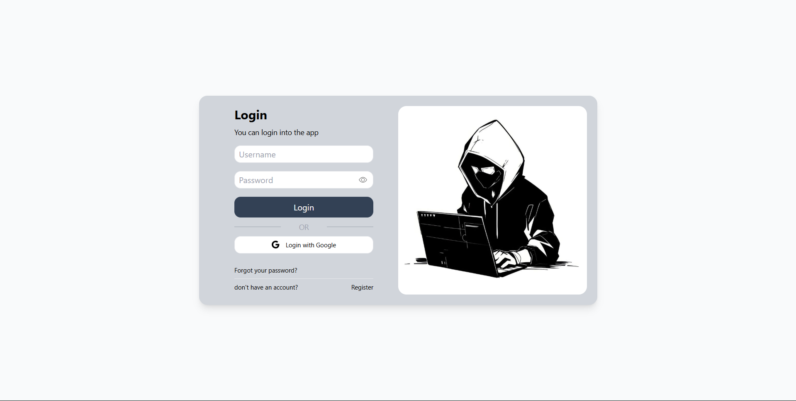

# Login Page

A simple and responsive login page built with **HTML** and **Tailwind CSS**.

## Features

- Responsive design
- Username and password input fields
- Password visibility toggle
- Google login button
- Forgot password and register links

## Installation

1. Clone the repository

2. Open `login.html` in your browser.

## Screenshot

## License

This project is open-source and free to use.
